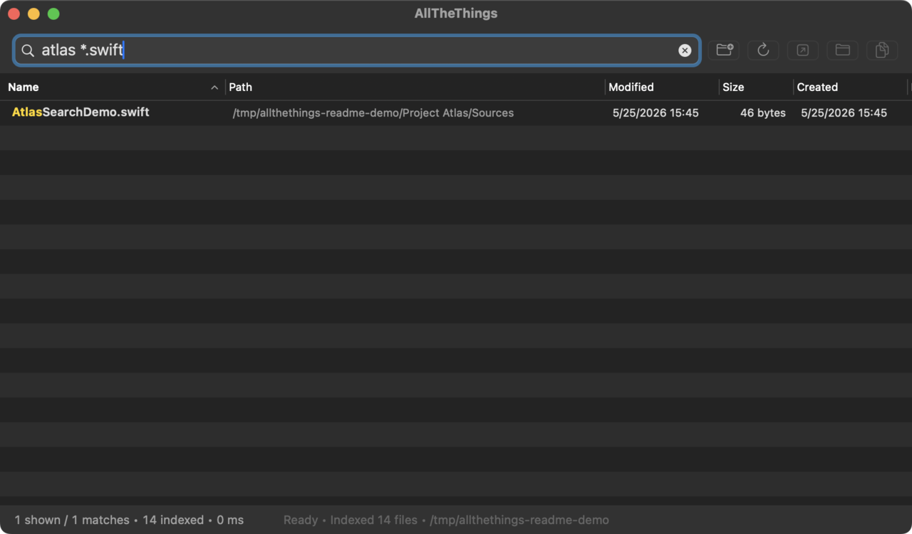

# AllTheThings

AllTheThings is a native macOS file-search app built for one fast loop: type a filename or path query, scan live results, then open, reveal, copy, rename, preview, or trash the matching files.

<picture>
  <source srcset="docs/images/allthethings-demo.webp" type="image/webp">
  
</picture>

## Requirements

- macOS 15 Sequoia or newer
- Apple Silicon Mac

## Getting Started

On first launch, AllTheThings indexes the default folders that exist on your Mac: `~/Desktop`, `~/Documents`, `~/Downloads`, `~/Developer`, and `/Applications`.

Use the folder-plus toolbar button to add folders. Use the refresh toolbar button to rebuild indexed scopes. The footer shows indexing state, match count, query time, and current indexed roots.

High-noise folders such as `node_modules`, `DerivedData`, `.git/objects`, `Library/Caches`, and `.Trash` are skipped.

## Searching

Type in the search field and results update immediately. Queries are case-insensitive and diacritic-insensitive. Space-separated positive terms must all match unless you use alternatives.

| Query | Meaning |
| --- | --- |
| `psr` | Fuzzy/acronym match, such as `PhotoSyncReport.final.pdf`. |
| `redme` | Small typo match for a filename like `README.md`. |
| `.swift` or `*.swift` | Match files by extension. |
| `atlas ext:swift` | Match `atlas` and require a Swift extension. |
| `name:Search*.swift` | Match a wildcard pattern against the filename. |
| `path:Sources ext:swift` | Match a path token and require Swift files. |
| `package !path:node_modules` | Match `package` but exclude `node_modules` paths. |
| `source/**/*.hpp` | Match structured path segments with `**` spanning folders. |

Useful prefixes include `name:`, `path:`, `ext:`, and `kind:`. The aliases `file:`, `filename:`, `basename:`, `folder:`, `dir:`, `directory:`, `extension:`, `suffix:`, and `type:` are also supported.

Use `!` or `-` to exclude a term, `|` for alternatives, and double quotes for an exact substring. Wildcards use `*` for any run of characters and `?` for one character.

## Results

Results are shown in a sortable table. The default sort is `Name` ascending, and AllTheThings remembers your selected sort when you reopen the app.

Right-click the header row to show or hide optional columns. `Name` stays visible so the table always has a primary label. Available columns include name, path, modified date, size, created date, extension, kind, and volume.

## Actions

Select one or more rows, then use the toolbar or context menu:

- Open files or reveal them in Finder.
- Copy selected files with `Command-C` or paths with `Command-Option-C`.
- Rename files, move files to Trash, open Quick Look, or open Get Info.
- Open terminal tabs/windows at the selected file's folder when Ghostty or iTerm2 exposes the matching macOS Services.

## Updates

AllTheThings checks GitHub for new releases from `MikeMarcin/AllTheThings` once per day on launch. You can run a manual check from **AllTheThings > Check for Updates...** or disable automatic checks from **AllTheThings > Automatically Check for Updates**.

## Privacy

AllTheThings indexes file metadata needed for search: paths, names, extensions, sizes, timestamps, folder/file status, hidden status, and volume names. It does not read file contents for search indexing.

Be careful when sharing screenshots or recordings. A file-search window can expose usernames, project names, client names, cloud folder names, and recently touched files.

## Troubleshooting

If expected files are missing, confirm the parent folder is indexed, click the refresh toolbar button, check whether the file is under a skipped folder, and make sure macOS privacy protections are not hiding the location.

If the app opens an existing running instance instead of starting a second copy, use **AllTheThings > Allow Multiple Instances**.

## Development

Source builds, VSCode tasks, architecture notes, and current implementation limits live in [docs/DEVELOPMENT.md](docs/DEVELOPMENT.md).

## Support Development

If AllTheThings saves you time, consider supporting continued work through [GitHub Sponsors](https://github.com/sponsors/MikeMarcin), starring the repository, or filing focused issues with reproducible examples.
