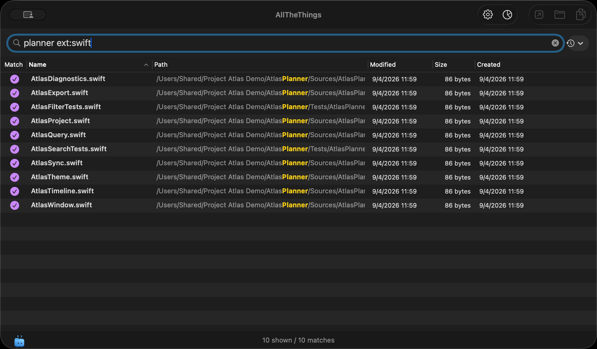

# AllTheThings

AllTheThings is a native macOS file-search app. It indexes file metadata locally and returns results as you type.

<picture>
  <source srcset="docs/images/allthethings-demo.webp" type="image/webp">
  
</picture>

## Requirements

- macOS 15 Sequoia or newer
- Apple Silicon Mac

## Getting Started

Download the DMG from the [latest release](https://github.com/MikeMarcin/AllTheThings/releases/latest), move AllTheThings to Applications, and open it. Search remains available while the initial index is being built.

By default, AllTheThings indexes `~/Desktop`, `~/Documents`, `~/Downloads`, and `~/Developer` when those folders exist. Use **Settings > Indexed Folders** to change that list, configure application search folders, check Full Disk Access, or rebuild the index. Application bundles are searched separately with `app:` so their internal files do not fill normal search results.

Two optional global shortcuts are available from **Settings > Hotkeys**:

- `Command-Shift-Space` opens file search.
- `Shift-Option-Space` opens application search.

Enable launch at login if you want the shortcuts available after signing in.

## Searching

Queries are case-insensitive and diacritic-insensitive. Separate terms with spaces to require all of them.

| Query | Meaning |
| --- | --- |
| `psr` | Fuzzy/acronym match, such as `PhotoSyncReport.final.pdf`. |
| `redme` | Small typo match for a filename like `README.md`. |
| `.swift` or `*.swift` | Match files by extension. |
| `name:Search*.swift` | Match a wildcard pattern against the filename. |
| `path:Sources ext:swift` | Match a path token and require Swift files. |
| `package !path:node_modules` | Match `package` but exclude `node_modules` paths. |
| `~/Projects/**/*.json` | Search below your home directory using `~` and path wildcards. |
| `app:terminal` | Search launchable `.app` bundles from configured application search folders. |
| `history:swift package` | Fuzzy-search saved queries for `swift package`. |

The main prefixes are `name:`, `path:`, `ext:`, `kind:`, `app:`, and `history:`. The `app:` and `history:` prefixes switch search modes; the others constrain file metadata. Use `!` or `-` to exclude a term, `|` for alternatives, and double quotes for an exact substring. Wildcards use `*` for any run of characters, `?` for one character, and `**` to span folders.

### Search History

Press `Command-Y`, click the history button, or type `history:` to browse earlier searches. Add text after the prefix to fuzzy-filter the list, sort by the **Search** or **Searched** column, and press Return to restore the selected query. For keyboard access to the compact menu, press Tab from the search field to focus its button, then press Space. In the open menu, use the arrow keys to move among queries or Tab to continue to the results; Tab from the results cycles back to the search field. `Control-R` and `Control-Shift-R` step backward and forward through history without opening the browser; Escape leaves history and restores the query you were editing.

AllTheThings records a query after it remains unchanged for three seconds or when you take an action on its results. It does not wait for a long-running search to finish, does not record each character you type, and never records the `history:` lookup itself. History rows support multiple selection, `Command-C` copies selected queries as separate lines, and Delete or the context menu removes them. In the compact history menu, highlight a query with the pointer or arrow keys and press Delete or Backspace to remove it. **Settings > General > Search history retention** keeps 50 searches by default and can be set to another limit, Off, or Unlimited.

## Actions

Select one or more results to open, reveal, copy, rename, preview, inspect, or move them to Trash. `Command-C` copies files; `Command-Option-C` copies their paths. AllTheThings can also use the macOS Services provided by Ghostty or iTerm2 to open a terminal in the selected folder.

## Updates

AllTheThings checks GitHub Releases once per day. Use **AllTheThings > Check for Updates...** to check manually or **AllTheThings > Automatically Check for Updates** to disable automatic checks.

## Privacy

AllTheThings indexes file metadata, not file contents. The index, search history, and diagnostic logs stay on your Mac and are never attached to update checks. Raw logs can contain search queries and file paths; use **AllTheThings > Export Anonymized Diagnostic Log...** before sharing them unless you intend to disclose that information.

macOS may request access when AllTheThings indexes Desktop, Documents, Downloads, or other protected locations. You can grant Full Disk Access from **System Settings > Privacy & Security > Full Disk Access** or limit the index to folders the app can already read.

AllTheThings skips common high-noise directories, including `node_modules`, `DerivedData`, `.git/objects`, `Library/Caches`, and `.Trash`. Screenshots can still expose filenames and paths, so check them before sharing.

## Troubleshooting

If a file is missing, confirm that its parent folder is indexed, check whether it is inside a skipped directory, and use **Reindex** if necessary. For missing applications, check the **Application Search** folders in **Settings > Indexed Folders**.

## Development

Build instructions, VSCode tasks, architecture notes, and implementation limits are in [docs/DEVELOPMENT.md](docs/DEVELOPMENT.md). Development is supported through [GitHub Sponsors](https://github.com/sponsors/MikeMarcin).
