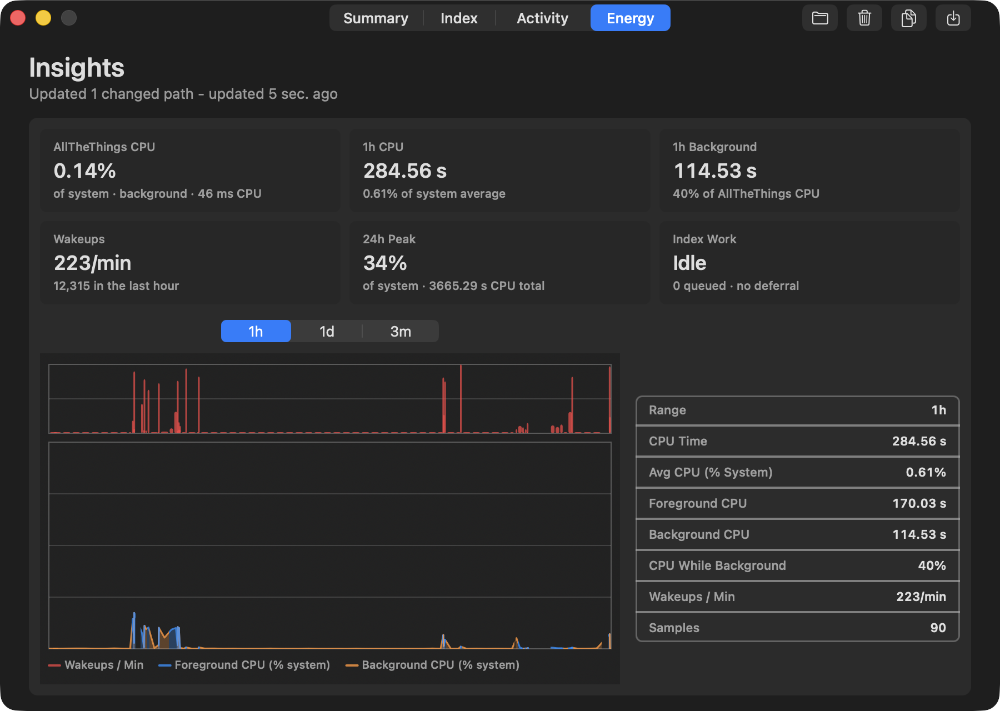

# AllTheThings

AllTheThings is a native macOS file-search app. It indexes file metadata locally and returns results as you type.

**[Download the latest release](https://github.com/MikeMarcin/AllTheThings/releases/latest)** for macOS 15 or newer on Apple Silicon. Website: [gamecoretech.com](https://gamecoretech.com/).

<picture>
  <source srcset="docs/images/allthethings-demo.webp" type="image/webp">
  
</picture>

## Requirements

- macOS 15 Sequoia or newer
- Apple Silicon Mac

## Getting Started

Download the DMG from the [latest release](https://github.com/MikeMarcin/AllTheThings/releases/latest), move AllTheThings to Applications, and open it. Search remains available while the initial index is being built.

By default, AllTheThings indexes `~/Desktop`, `~/Documents`, `~/Downloads`, and `~/Developer` when those folders exist. Use **Settings > Indexed Folders** to change that list, configure application search folders, check Full Disk Access, or rebuild the index. Application bundles are searched separately with `app:` so their internal files do not fill normal search results.

Two optional global shortcuts are available from **Settings > Hotkeys**:

- `Command-Shift-Space` opens file search.
- `Shift-Option-Space` opens application search.

Enable launch at login if you want the shortcuts available after signing in.

## Searching

Queries are case-insensitive and diacritic-insensitive. Separate terms with spaces to require all of them.

| Query | Meaning |
| --- | --- |
| `psr` | Fuzzy and acronym match, such as `PhotoSyncReport.final.pdf`. |
| `redme` | Small typo match for a filename like `README.md`. |
| `*.swift` | `*` matches any run of characters and `?` matches one. |
| `ext:swift\|md` | `\|` separates alternatives. |
| `name:Search*.swift` | Match a pattern against the file name only. |
| `path:Sources ext:swift` | Combine constraints. Path tokens and extensions stack. |
| `package !path:node_modules` | Exclude with `!` or `-`. |
| `~/Projects/**/*.json` | Search below a folder. `**` spans nested folders. |
| `"query planner"` | Quotes match the exact substring, spaces included. |
| `app:terminal` | Search installed applications instead of files. |
| `history:swift package` | Search your own past queries. |

The main prefixes are `name:`, `path:`, `ext:`, `kind:`, `app:`, and `history:`. The `app:` and `history:` prefixes switch search modes; the others constrain file metadata. Use `!` or `-` to exclude a term, `|` for alternatives, and double quotes for an exact substring. Wildcards use `*` for any run of characters, `?` for one character, `[abc]` for one character from a set (so `*.[hic]pp` matches `.hpp`, `.ipp`, and `.cpp`), and `**` to span folders.

### Search History

Press `Command-Y`, click the history button, or type `history:` to browse earlier searches. Add text after the prefix to fuzzy-filter the list, and press Return to restore the selected query. `Control-R` and `Control-Shift-R` step backward and forward through history without opening the browser.

A query is recorded after it remains unchanged for three seconds or when you act on its results; individual keystrokes and `history:` lookups are never recorded. **Settings > General > Search history retention** keeps 50 searches by default. Keyboard navigation and management details are in [docs/SEARCH_HISTORY.md](docs/SEARCH_HISTORY.md).

## Actions

Select one or more results to open, reveal, copy, rename, preview, inspect, or move them to Trash. `Command-C` copies files; `Command-Option-C` copies their paths. AllTheThings can also use the macOS Services provided by Ghostty or iTerm2 to open a terminal in the selected folder.

## Insights

**AllTheThings > Insights...** (`Command-Option-Shift-I`) shows what the index is doing: how many files it tracks, how much disk the index package uses, how each search was routed and how long it took, and the app's CPU time and wakeups for the last hour, day, or three months. An indexer runs all day, so its cost should be easy to check.

<picture>
  <source srcset="docs/images/allthethings-insights.webp" type="image/webp">
  
</picture>

## Updates

AllTheThings checks GitHub Releases once per day. Use **AllTheThings > Check for Updates...** to check manually or **AllTheThings > Automatically Check for Updates** to disable automatic checks.

## Privacy

AllTheThings indexes file metadata, not file contents. The index, search history, and diagnostic logs stay on your Mac and are never attached to update checks. Raw logs can contain search queries and file paths; use **AllTheThings > Export Anonymized Diagnostic Log...** before sharing them unless you intend to disclose that information.

macOS may request access when AllTheThings indexes Desktop, Documents, Downloads, or other protected locations. You can grant Full Disk Access from **System Settings > Privacy & Security > Full Disk Access** or limit the index to folders the app can already read.

AllTheThings skips common high-noise directories, including `node_modules`, `DerivedData`, `.git/objects`, `Library/Caches`, and `.Trash`. Screenshots can still expose filenames and paths, so check them before sharing.

## Troubleshooting

If a file is missing, confirm that its parent folder is indexed, check whether it is inside a skipped directory, and use **Reindex** if necessary. For missing applications, check the **Application Search** folders in **Settings > Indexed Folders**.

## Contributing

Build instructions, VSCode tasks, architecture notes, and implementation limits are in [docs/DEVELOPMENT.md](docs/DEVELOPMENT.md). Bug reports with reproducible cases, documentation fixes, and code contributions are welcome through GitHub issues and pull requests. Development is supported through [GitHub Sponsors](https://github.com/sponsors/MikeMarcin).

## License

AllTheThings is released under the [MIT License](LICENSE).
